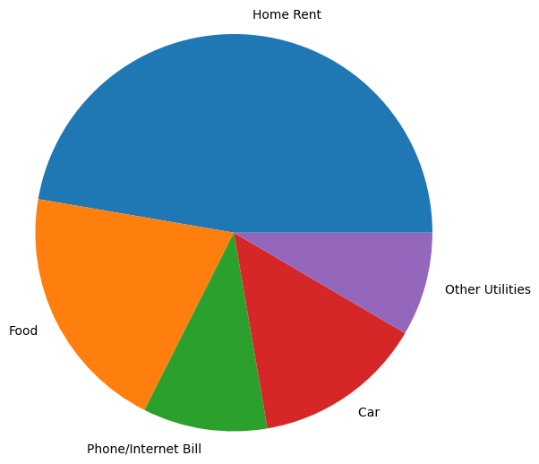

# Matpoltlib

## Importing matplotlib pyplot


```python
import matplotlib.pyplot as plt
import numpy as np
%matplotlib inline
```

## Simple plot


```python
x = [1,2,3,4,5,6,7,8] 
y = [50 , 34, 67, 44, 55,54, 56,39] 
plt.plot(x , y) 
plt.show()
```


    

    


```python
x = [1,2,3,4,5,6,7,8] 
y = [50 , 34, 67, 44, 55,54, 56,39] 
plt.plot(x , y , color = "green" , linewidth=5 , linestyle = "dotted") 
plt.show()
```


    

    


## Lable and Title


```python
plt.xlabel("Day")
plt.ylabel("Temperature")
plt.title("Weather Data")
plt.plot(x ,y)
```


    [<matplotlib.lines.Line2D at 0x7f2697f0a290>]


    

    


## Format String


```python
plt.plot(x ,y , "g--+")
# g : green
# + : point indicator
# -- : doted 
# and so on in documantation....
```


    [<matplotlib.lines.Line2D at 0x7f2697d59030>]


    

    


```python
plt.plot(x , y , linestyle = "--" , color = "green" , marker = "+") 
# same output 
# makersize --> for set size of maker
```


    [<matplotlib.lines.Line2D at 0x7f2697dbfbb0>]


    

    


```python
plt.plot(x , y , alpha = 0.1) # alhpa --> transparency 0 - 1 
# 0 --> invisible
# 1 --> full 
# There are so many porperties in plot documantation
```


    [<matplotlib.lines.Line2D at 0x7f2697c4ef20>]


    

    


## Multiple graps


```python
# Data
days=[1,2,3,4,5,6,7]
max_t=[50,51,52,48,47,49,46]
min_t=[43,42,40,44,33,35,37]
avg_t=[45,48,48,46,40,42,41]
# Graps
plt.plot(days , max_t)    # x axis = days and y axis = max_t
plt.plot(days , min_t)    # x axis = days and y axis = min_t
plt.plot(days , avg_t)    # x axis = days and y axis = avg_t
plt.show()
```


    

    


## Create Lable


```python
plt.plot(days , max_t , label = "Max")    # set a label Max
plt.plot(days , min_t , label = "Min")    # set a label Min
plt.plot(days , avg_t , label = "Avg")    # set a label Avg
# It will not display until we use:
plt.legend()
# Change location of legend:
plt.legend(loc = "best")       # set in best place automatically
plt.legend(loc = "lower left" , fontsize = "large") # set in lower left and font size large

# Greading:
plt.grid()   # make grid lines in plot
```


    

    


## Bar Chart


```python
company=['GOOGL','AMZN','MSFT','FB']
revenue=[90,136,89,27]
profit = [40 , 2 , 32 , 12]
xposition = np.arange(len(company))
print(xposition)
```

    [0 1 2 3]


```python
plt.bar(xposition , revenue)
```


    <BarContainer object of 4 artists>


    

    


```python
# Replace 1 , 2 , 3 etc to lables:
plt.bar(xposition , revenue, label = "Revenue")
plt.xticks(xposition , company , label = "Coumpany")

# Plot 2 bar chart:
plt.bar(xposition , profit , label= "Profit")  # new bar chart profit
plt.legend()  # print label
```


    <matplotlib.legend.Legend at 0x7f2697c4f1c0>


    

    


```python
# Plot side by side:
plt.bar(xposition - 0.2 , revenue, label = "Revenue" , width=0.4)
plt.bar(xposition + 0.2 , profit , label= "Profit" , width= 0.4)
plt.legend()
```


    <matplotlib.legend.Legend at 0x7f2697d9c0a0>


    

    


```python
# Horizontal bar chart:
plt.barh(xposition - 0.2 , revenue, label = "Revenue" , height=0.4)
plt.barh(xposition + 0.2 , profit , label= "Profit" , height= 0.4)
plt.legend()
```


    <matplotlib.legend.Legend at 0x7f269ff7c100>


    

    


## Histogram


```python
blood_sugar = [113, 85, 90, 150, 149, 88, 93, 115, 135, 80, 77, 82, 129]
plt.hist(blood_sugar , rwidth=.95 ) # rwidth --> relative width
# bins --> set ranges box n ... default is n bins 
```


    (array([3., 3., 1., 0., 1., 1., 0., 2., 0., 2.]),
     array([ 77. ,  84.3,  91.6,  98.9, 106.2, 113.5, 120.8, 128.1, 135.4,
            142.7, 150. ]),
     <BarContainer object of 10 artists>)


    

    


```python
# Bins
plt.hist(blood_sugar,rwidth=0.5,bins=4)
```


    (array([7., 1., 2., 3.]),
     array([ 77.  ,  95.25, 113.5 , 131.75, 150.  ]),
     <BarContainer object of 4 artists>)


    

    


```python
# Custom bins:

plt.xlabel("Sugar Level")
plt.ylabel("Number Of Patients")
plt.title("Blood Sugar Chart")

plt.hist(blood_sugar, bins=[80,100,125,150], rwidth=0.95, color='g')
```


    (array([6., 2., 4.]),
     array([ 80., 100., 125., 150.]),
     <BarContainer object of 3 artists>)


    

    


```python
# Side by side Histogram:

plt.xlabel("Sugar Level")
plt.ylabel("Number Of Patients")
plt.title("Blood Sugar Chart")

blood_sugar_men = [113, 85, 90, 150, 149, 88, 93, 115, 135, 80, 77, 82, 129]
blood_sugar_women = [67, 98, 89, 120, 133, 150, 84, 69, 89, 79, 120, 112, 100]

plt.hist([blood_sugar_men,blood_sugar_women], bins=[80,100,125,150], rwidth=0.95, color=['green','orange'],label=['Men','Women'])
plt.legend()
```


    <matplotlib.legend.Legend at 0x7f269783e050>


    

    


```python
# histtype=step
plt.xlabel("Sugar Level")
plt.ylabel("Number Of Patients")
plt.title("Blood Sugar Chart")

plt.hist(blood_sugar,bins=[80,100,125,150],rwidth=0.95,histtype='step')
```


    (array([6., 2., 4.]),
     array([ 80., 100., 125., 150.]),
     [<matplotlib.patches.Polygon at 0x7f26978f3130>])


    

    


```python
# horizontal orientation:
plt.xlabel("Number Of Patients")
plt.ylabel("Sugar Level")
plt.title("Blood Sugar Chart")

plt.hist(blood_sugar, bins=[80,100,125,150], rwidth=0.95, orientation='horizontal')
```


    (array([6., 2., 4.]),
     array([ 80., 100., 125., 150.]),
     <BarContainer object of 3 artists>)


    

    


## Pie Chart


```python
exp_vals = [1400,600,300,410,250]
exp_labels = ["Home Rent","Food","Phone/Internet Bill","Car ","Other Utilities"]
plt.pie(exp_vals,labels=exp_labels)
plt.show()
```


    

    


```python
# Change Redious:
plt.pie(exp_vals,labels=exp_labels , radius=1.5) # Default value is 1
plt.show()
```


    

    


```python
# Show percentage ( % ):
plt.pie(exp_vals,labels=exp_labels , autopct = "%0.2f%%" )# 0.2 --> after point digits

# Shadow :
plt.pie(exp_vals,labels=exp_labels , autopct = "%0.2f%%" , shadow=True)
plt.show()
```


    

    


```python
# Explade:
plt.pie(exp_vals,labels=exp_labels, autopct='%1.1f%%',explode=[0,0,0,0.1,0.2])
plt.show()
```


    

    


```python
# Rotate:
plt.pie(exp_vals,labels=exp_labels, autopct='%1.1f%%',explode=[0,0,0,0.1,0.2] , startangle = 90)
plt.show()   # rotate 90 digres
```


    

    


## Save Chart


```python
plt.pie(exp_vals,labels=exp_labels, autopct='%1.1f%%',explode=[0,0,0,0.1,0.2] , startangle = 90)
plt.savefig("pie.png")
# Some Argument:
# bbox_inchies , pad_inchies , transparent etc..
```


    

    

